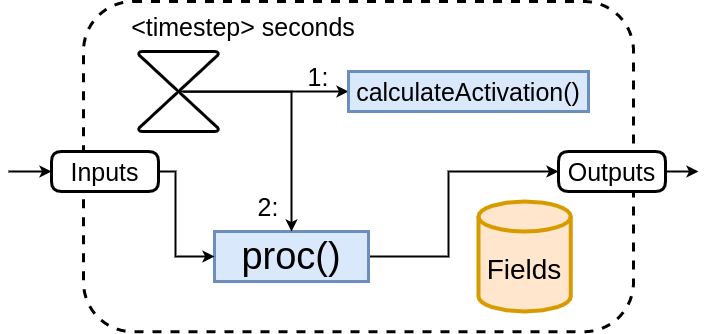

# Distributed Cognitive Toolkit

The Distributed Cognitive Toolkit (DCT) is a toolkit that allow the construction of Distributed Cognitive Architectures, either in the form of containers of in a multi-device fashion. The DCT defines some principles that can be reproduced in any programming language but we currently have an implementation in shellscript and python.

This project is based on [Cognitive Systems Toolkit (CST)](https://github.com/CST-Group/cst) and follows the same theories what CST rellies on.

## Requirements
- All scripts in this repository presume execution in a **Linux** environment (or another system with **bash** support). 
- Currently, the default scripts presented here also use **Python 3**, but this is optional as you may make any change you want.

## Cognitive Architectures

Cognitive Architectures are general-purpose control systems' architectures inspired by scientific theories developed to explain cognition in animals and men. Cognitive Architectures have been employed in many different kinds of applications, since the control of robots to decision-making processes in intelligent agents. Usually, a cognitive architecture is decomposed based on its cognitive capabilities, like perception, attention, memory, reasoning, learning, behavior generation, etc. Cognitive Architectures are, at the same time, theoretical modelings for how many different cognitive processes interact to each other in order to sense, reason and act, and also a software framework which can be reused through different applications. The most popular cognitive architectures usually have their code available at the Internet (with different kinds of licenses), such that different researchers are able to download this code and make experimentations with these architectures.

## Basic Notions

As this project is mainly based in the already cited CST, it follows the same theories and overall structure. The figure 1 illustrates the core entities of the toolkit. The basic notion, which is used in a widespread way within the cognitive architecture is the notion of a codelet. Codelets are small pieces of non-blocking code, each of them executing a well defined and simple task. The idea of a codelet is of a piece of code which ideally shall be executed continuously and cyclically, time after time, being responsible for the behavior of a system's independent component running in parallel. The notion of codelet was introduced originally by Hofstadter and Mitchell (1994) and further enhanced by Franklin (1998). The DCT architecture is codelet oriented, since all main cognitive functions are implemented as codelets. This means that from a conceptual point of view, any DCT-implemented system is a fully parallel asynchronous multi-agent system, where each agent is modeled by a codelet. Nevertheless, for the system to work, a kind of coordination must exist among codelets, forming coalitions which by means of a coordinated interaction, are able to implement the cognitive functions ascribed to the architecture. For futher information please refers [here](https://github.com/CST-Group/cst).

Figure 1 - The CST Core as shown in Paraense (2016)

Beside Codelets and Memories, the DCT uses the notion of **Node**. A Node is a physical or virtual device which contains any number of Codelets and/or Memories. The Node is controlled by the **nodeMaster**, a process that is responsible for run, mantain and shutdown all internal entities and a tcp server to listen information requests.

## Usage

In order to make a **Codelet** work, it must have a *proc* method that will be called in a loop, the registry all important information including the input and output **Memories**, with allias, the ip/port for communication and the type of communication (a mongo DB, a Redis DB or just a comm over TCP) and, if needed, a configuration of a server to receive TCP msgs. Then, the script must be called to put the codelet in activity. This structure, although simple, allows this kind of Codelet to run in very limited hardwares or multiple ones run in a more powerful computing system, like a Desktop or Notebook. It is highly recommended that you run the Nodes inside containers (like a **Docker** Container) if you working on a PC (or other multipurpose system) to both have a better control over network configurations and to avoid issues that may harm your system.

This repository also contains utility scripts, including **Docker-compose** scripts, that facilitates the usage and makes some experiments, like massive Node adding, easier.

### Structure of a Node 
 --

### Structure of a Codelet

Figure 2 - The concept of a DCT Codelet.

In the src/codelets folder you can find all implementations of the DCT **Codelet** (currently in Python only) with all auxiliary scripts. The *methods* folder contains all basic scripts to make the codelet work and is not meant to be changed (with exception if you want to do your own implementation). In the codelet's root folder you may find six files and another folder (besides methods):

- codelet.py
- dct.py
- fields.json
- memories

The *fields.json* file contains information regarding this codelet, including *name*, *timestep*, *inputs* and *outputs*. Here, inputs and outputs are lists with strutures containing *ip/port*, *name* and *type*, and represents each **Memory** which this codelet interacts. The second one *codelet.py*, represent the base script of the **Codelet** itself and it is up to the user to extend the base *Class* and implement the relevant code. Remember that the *proc* method is called in a loop, with a sleep of *timestep* seconds between each call.

The *dct.py* file is a module with some the base Class (Codelet) and some commonly used functions.

Finally, the memories folder should contain all simple **.json**
 files representing memories readed or writen through TCP communication.

### Structure of a Memory

The basic structure of what consists the is something like this:

*{"name": "motor-memory", "ip/port": "172.28.1.1:9999", "type": "tcp", "group": [], "I": "3671", "eval": 0.0}*

The **'I'** field may contain any type of data, been responsability of the user to deal with the information correctly. The **group** field is an array of label that may be used by Codelets to select just some inputs or outputs.

Note that it is writen as a json object and may be inside a *.json* file or as a entry in a database such mongo or redis. 

### Running a Codelet inside a Docker Container

In the examples/docker folder there are four docker examples: three using a specific type of Memory access (TCP, Mongo or Redis) and one using all of them. Each example contains a *docker-compose.yml* file that configures how each **Node**-Container should be and, when the script *mind_run.sh* runs, it creates some containers, including MongoDB and Redis containers, if is the case. Those simple examples ilustrate the communication between the **Codelets** based on the information present in the *fields.json* and the parallel nature of this toolkit. 

Further explanation is given on the *readme.md* inside each example.

All containers are created with [pythonCodelet](https://hub.docker.com/repository/docker/wandgibaut/python_codelet) image, which is based on python3 image with *pymongo* and *redis* installed.

# ____________________________________________

Note: This project is still under development, and some concepts or features might not be available yet. [Feedback/bug report](https://github.com/wandgibaut/dct/issues) and [Pull Requests](https://github.com/wandgibaut/dct/pulls) are most welcome!